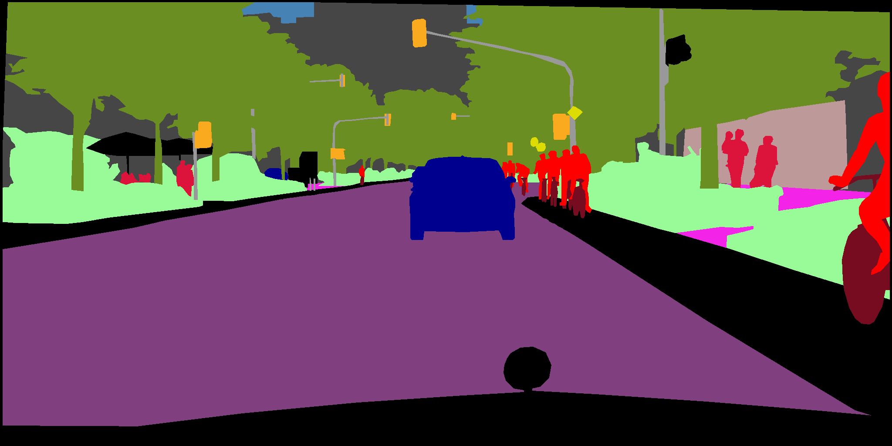
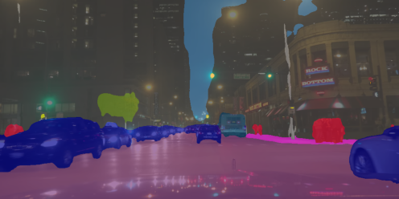

# DeepLabv3Plus-Pytorch

Baseline model DeepLabv3, DeepLabv3+ for Carla-EPE-23, modified from VainF's [repository](https://github.com/VainF/DeepLabV3Plus-Pytorch).

## Quick Start 

### 1. Available Architectures
Specify the model architecture with '--model ARCH_NAME' and set the output stride using '--output_stride OUTPUT_STRIDE'.

| DeepLabV3    |  DeepLabV3+        |
| :---: | :---:     |
|deeplabv3_resnet50|deeplabv3plus_resnet50|
|deeplabv3_resnet101|deeplabv3plus_resnet101|
|deeplabv3_mobilenet|deeplabv3plus_mobilenet ||
|deeplabv3_hrnetv2_48 | deeplabv3plus_hrnetv2_48 |
|deeplabv3_hrnetv2_32 | deeplabv3plus_hrnetv2_32 |
|deeplabv3_xception | deeplabv3plus_xception |


<!--All pretrained models: [Dropbox](https://www.dropbox.com/sh/w3z9z8lqpi8b2w7/AAB0vkl4F5vy6HdIhmRCTKHSa?dl=0), [Tencent Weiyun](https://share.weiyun.com/qqx78Pv5)

Note: The HRNet backbone was contributed by @timothylimyl. A pre-trained backbone is available at [google drive](https://drive.google.com/file/d/1NxCK7Zgn5PmeS7W1jYLt5J9E0RRZ2oyF/view?usp=sharing).

### 2. Load the pretrained model:
```python
model.load_state_dict( torch.load( CKPT_PATH )['model_state']  )
```
### 3. Visualize segmentation outputs:
```python
outputs = model(images)
preds = outputs.max(1)[1].detach().cpu().numpy()
colorized_preds = val_dst.decode_target(preds).astype('uint8') # To RGB images, (N, H, W, 3), ranged 0~255, numpy array
# Do whatever you like here with the colorized segmentation maps
colorized_preds = Image.fromarray(colorized_preds[0]) # to PIL Image
```

### 4. Atrous Separable Convolution

**Note**: All pre-trained models in this repo were trained without atrous separable convolution.

Atrous Separable Convolution is supported in this repo. We provide a simple tool ``network.convert_to_separable_conv`` to convert ``nn.Conv2d`` to ``AtrousSeparableConvolution``. **Please run main.py with '--separable_conv' if it is required**. See 'main.py' and 'network/_deeplab.py' for more details. 

### 5. Prediction
Single image:
```bash
python predict.py --input datasets/data/cityscapes/leftImg8bit/train/bremen/bremen_000000_000019_leftImg8bit.png  --dataset cityscapes --model deeplabv3plus_mobilenet --ckpt checkpoints/best_deeplabv3plus_mobilenet_cityscapes_os16.pth --save_val_results_to test_results
```

Image folder:
```bash
python predict.py --input datasets/data/cityscapes/leftImg8bit/train/bremen  --dataset cityscapes --model deeplabv3plus_mobilenet --ckpt checkpoints/best_deeplabv3plus_mobilenet_cityscapes_os16.pth --save_val_results_to test_results
```

### 6. New backbones

Please refer to [this commit (Xception)](https://github.com/VainF/DeepLabV3Plus-Pytorch/commit/c4b51e435e32b0deba5fc7c8ff106293df90590d) for more details about how to add new backbones.-->

## Results

<!--### 1. Performance on Pascal VOC2012 Aug (21 classes, 513 x 513)

Training: 513x513 random crop  
validation: 513x513 center crop

|  Model          | Batch Size  | FLOPs  | train/val OS   |  mIoU        | Dropbox  | Tencent Weiyun  | 
| :--------        | :-------------: | :----:   | :-----------: | :--------: | :--------: | :----:   |
| DeepLabV3-MobileNet       | 16      |  6.0G      |   16/16  |  0.701     |    [Download](https://www.dropbox.com/s/uhksxwfcim3nkpo/best_deeplabv3_mobilenet_voc_os16.pth?dl=0)       | [Download](https://share.weiyun.com/A4ubD1DD) |
| DeepLabV3-ResNet50         | 16      |  51.4G     |  16/16   |  0.769     |    [Download](https://www.dropbox.com/s/3eag5ojccwiexkq/best_deeplabv3_resnet50_voc_os16.pth?dl=0) | [Download](https://share.weiyun.com/33eLjnVL) |
| DeepLabV3-ResNet101         | 16      |  72.1G     |  16/16   |  0.773     |    [Download](https://www.dropbox.com/s/vtenndnsrnh4068/best_deeplabv3_resnet101_voc_os16.pth?dl=0)       | [Download](https://share.weiyun.com/iCkzATAw)  |
| DeepLabV3Plus-MobileNet   | 16      |  17.0G      |  16/16   |  0.711    |    [Download](https://www.dropbox.com/s/0idrhwz6opaj7q4/best_deeplabv3plus_mobilenet_voc_os16.pth?dl=0)   | [Download](https://share.weiyun.com/djX6MDwM) |
| DeepLabV3Plus-ResNet50    | 16      |   62.7G     |  16/16   |  0.772     |    [Download](https://www.dropbox.com/s/dgxyd3jkyz24voa/best_deeplabv3plus_resnet50_voc_os16.pth?dl=0)   | [Download](https://share.weiyun.com/uTM4i2jG) |
| DeepLabV3Plus-ResNet101     | 16      |  83.4G     |  16/16   |  0.783     |    [Download](https://www.dropbox.com/s/bm3hxe7wmakaqc5/best_deeplabv3plus_resnet101_voc_os16.pth?dl=0)   | [Download](https://share.weiyun.com/UNPZr3dk) |-->


### 1. Performance on Datasets (19 classes, 1024 x 2048)

Model: DeepLabV3Plus-ResNet101

|  Dataset          | Train Crop | Val Crop| Batch Size  | train/val OS   |  mIoU        | Train History |
| :--------        | :-------------: | :----:   | :-----------: |:-----------: | :--------: | :--: |
| CityScapes   | 768x768 | 1024x2048 |  16    |  16/16   |  0.7711  | [W&B](https://wandb.ai/foster-chen/DeepLabv3plus/runs/19cptw4j) |
| NightCity   | 512x512  |  512x1024 | 16       |  16/16   |  0.5300 | [W&B](https://wandb.ai/foster-chen/DeepLabv3plus/runs/2qc0x3ov) |

<!--
#### Segmentation Results on Pascal VOC2012 (DeepLabv3Plus-MobileNet)

<div>


</div>

<div>


</div>

<div>


</div>-->

#### Segmentation Results on CityScapes (DeepLabv3Plus-ResNet101)

<div>


</div>

#### Segmentation Results on NightCity (DeepLabv3Plus-ResNet101)

<div>


</div>

<!--
#### Visualization of training


-->

<!--
## Pascal VOC

### 1. Requirements

```bash
pip install -r requirements.txt
```

### 2. Prepare Datasets

#### 2.1 Standard Pascal VOC
You can run train.py with "--download" option to download and extract pascal voc dataset. The defaut path is './datasets/data':

```
/datasets
    /data
        /VOCdevkit 
            /VOC2012 
                /SegmentationClass
                /JPEGImages
                ...
            ...
        /VOCtrainval_11-May-2012.tar
        ...
```

#### 2.2  Pascal VOC trainaug (Recommended!!)

See chapter 4 of [2]

        The original dataset contains 1464 (train), 1449 (val), and 1456 (test) pixel-level annotated images. We augment the dataset by the extra annotations provided by [76], resulting in 10582 (trainaug) training images. The performance is measured in terms of pixel intersection-over-union averaged across the 21 classes (mIOU).

*./datasets/data/train_aug.txt* includes the file names of 10582 trainaug images (val images are excluded). Please to download their labels from [Dropbox](https://www.dropbox.com/s/oeu149j8qtbs1x0/SegmentationClassAug.zip?dl=0) or [Tencent Weiyun](https://share.weiyun.com/5NmJ6Rk). Those labels come from [DrSleep's repo](https://github.com/DrSleep/tensorflow-deeplab-resnet).

Extract trainaug labels (SegmentationClassAug) to the VOC2012 directory.

```
/datasets
    /data
        /VOCdevkit  
            /VOC2012
                /SegmentationClass
                /SegmentationClassAug  # <= the trainaug labels
                /JPEGImages
                ...
            ...
        /VOCtrainval_11-May-2012.tar
        ...
```

### 3. Training on Pascal VOC2012 Aug

#### 3.1 Visualize training (Optional)

Start visdom sever for visualization. Please remove '--enable_vis' if visualization is not needed. 

```bash
# Run visdom server on port 28333
visdom -port 28333
```

#### 3.2 Training with OS=16

Run main.py with *"--year 2012_aug"* to train your model on Pascal VOC2012 Aug. You can also parallel your training on 4 GPUs with '--gpu_id 0,1,2,3'

**Note: There is no SyncBN in this repo, so training with *multple GPUs and small batch size* may degrades the performance. See [PyTorch-Encoding](https://hangzhang.org/PyTorch-Encoding/tutorials/syncbn.html) for more details about SyncBN**

```bash
python main.py --model deeplabv3plus_mobilenet --enable_vis --vis_port 28333 --gpu_id 0 --year 2012_aug --crop_val --lr 0.01 --crop_size 513 --batch_size 16 --output_stride 16
```

#### 3.3 Continue training

Run main.py with '--continue_training' to restore the state_dict of optimizer and scheduler from YOUR_CKPT.

```bash
python main.py ... --ckpt YOUR_CKPT --continue_training
```

#### 3.4. Testing

Results will be saved at ./results.

```bash
python main.py --model deeplabv3plus_mobilenet --enable_vis --vis_port 28333 --gpu_id 0 --year 2012_aug --crop_val --lr 0.01 --crop_size 513 --batch_size 16 --output_stride 16 --ckpt checkpoints/best_deeplabv3plus_mobilenet_voc_os16.pth --test_only --save_val_results
```
-->

## Dataset Path format

### CityScapes

```
/datasets
    /cityscapes
        /gtFine
        /leftImg8bit
```

### NightCity

```
/datasets
    /NightLab
        /train
            /image
            /label
        /val
            /image
            /label
```
<!--
### ***Any*** synthetic data (CARLA)

```
/datasets
    /name_of_dataset
        /train
            /rgb
            /semantic
        /val
            /rgb
            /semantic
```
-->

## Model training
CityScapes
```bash
python main.py --model deeplabv3plus_resnet101 --dataset cityscapes --lr 0.1 --crop_size 768 --batch_size 16 --output_stride 16 --data_root /your_dataset_path/CityScapes --gpu_id 0,1 --run_name set_custom_runname --save_val_results 5
```
NightCity
```bash
main.py --model deeplabv3plus_resnet101 --dataset nightlab --gpu_id 0,1 --lr 0.1 --crop_size 512 --batch_size 16 --output_stride 16 --data_root /your_dataset_path/NightLab/ --run_name set_custom_runname --save_val_results 5
```
Boosting dataset with synthetic data <br/>
***to be added***


Additional options
- `--run_name`: Determine a custom run name, default is "unnamed"
- `--wandb`: Use Weights & Bias monitoring while training
- *`--boost_dataset`: Name of synthetic data, only support "carla" atm
- *`--boost_data_root`: Root of synthetic data
- *`--boost_strength`: The proportion of synthetic data in one batch. $\require{textmacros} boost \_ batch \_ size = \textrm{round}(batch\_ size \times boost\_ strength)$, $real\_ batch\_ size = batch\_ size - boost\_ batch\_ size$

\* : Not finalized due to recent changes in Carla source code

### Reference

[1] [Rethinking Atrous Convolution for Semantic Image Segmentation](https://arxiv.org/abs/1706.05587)

[2] [Encoder-Decoder with Atrous Separable Convolution for Semantic Image Segmentation](https://arxiv.org/abs/1802.02611)
